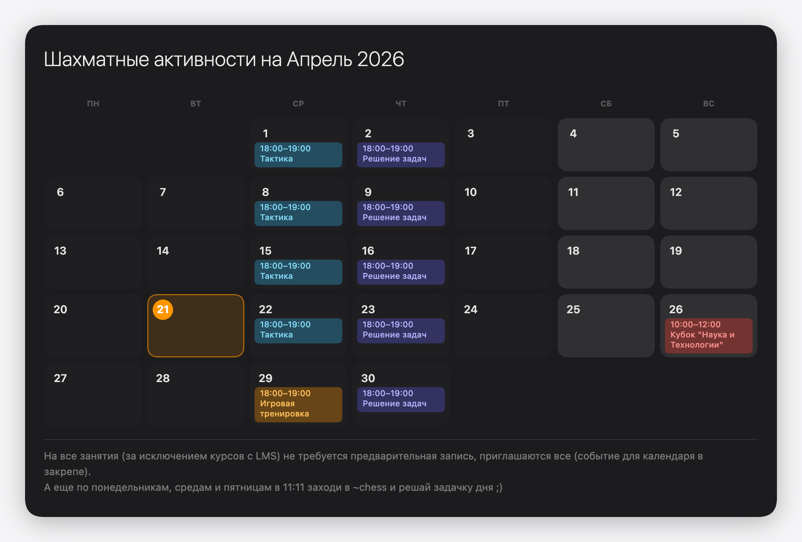

# Monthly Digest

A zero-dependency, single-file tool for generating monthly event digests — calendar PNG, Telegram and Slack posts.

## Features

- **Recurring rules** — set weekly events once, they fill the whole month automatically
- **Last-weekday overrides** — replace a recurring slot on the last occurrence (e.g. "last Wednesday becomes game night")
- **One-off events** — add specific dates with optional Meet/Zoom links
- **Calendar view** — dark-card visual calendar with today highlight and weekend shading
- **Copy as PNG** — exports a high-resolution calendar image straight to the clipboard
- **Telegram & Slack digests** — formatted text output ready to paste
- **Per-month persistence** — state is saved in `localStorage`; switching months preserves everything
- **Copy to next month** — carries rules and description forward with one click
- **Configurable** — all labels, event types, colors and defaults live in `src/config.js`

## Quickstart

Build and open `monthly_digest.html` in any browser — no server required.

## Development

```bash
# Edit sources in src/
# Then rebuild the self-contained file:
node build.js
```

`build.js` inlines `src/style.css`, `src/config.js` and `src/app.js` into a single `monthly_digest.html`.

## Customisation

Edit `src/config.js` to change:

| Field | What it controls |
|---|---|
| `title` / `subtitle` | App heading |
| `calendarTitle` | Title inside the calendar card |
| `digestHeader` / `digestFooter` | Digest text templates |
| `eventTypes` | Event categories, icons and chip colors |
| `defaultRules` | Pre-filled weekly schedule |
| `defaultLastWeekRules` | Pre-filled last-weekday overrides |
| `storageKey` | `localStorage` key (change to run multiple instances) |

After editing, run `node build.js` to regenerate `monthly_digest.html`.

## Example — Chess Digest (RU)

